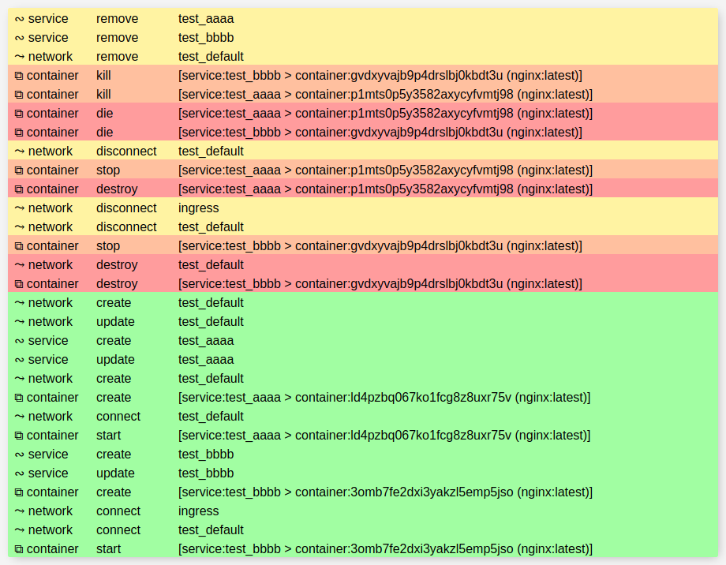

## docker-watch

A events log for the web, using aiodocker and aiohttp. 

[Automated builds](https://hub.docker.com/r/c45y/docker-watch/)

## Usage
```bash
docker run -p 8080:8080 -v /var/run/docker.sock:/var/run/docker.sock:ro c45y/docker-watch
```
**OR**

```yaml
version: "3"
services:
  watch:
    image: c45y/docker-watch
    deploy:
      mode: replicated
      replicas: 1
      placement:
        constraints:
          - node.role == manager
    volumes:
      - "/var/run/docker.sock:/var/run/docker.sock:ro"
    ports:
      - "8080"
```


